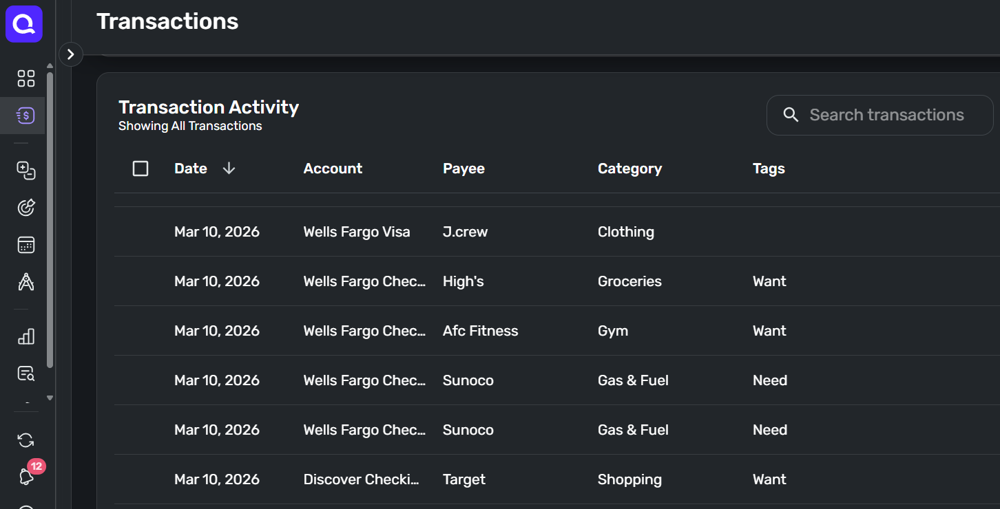
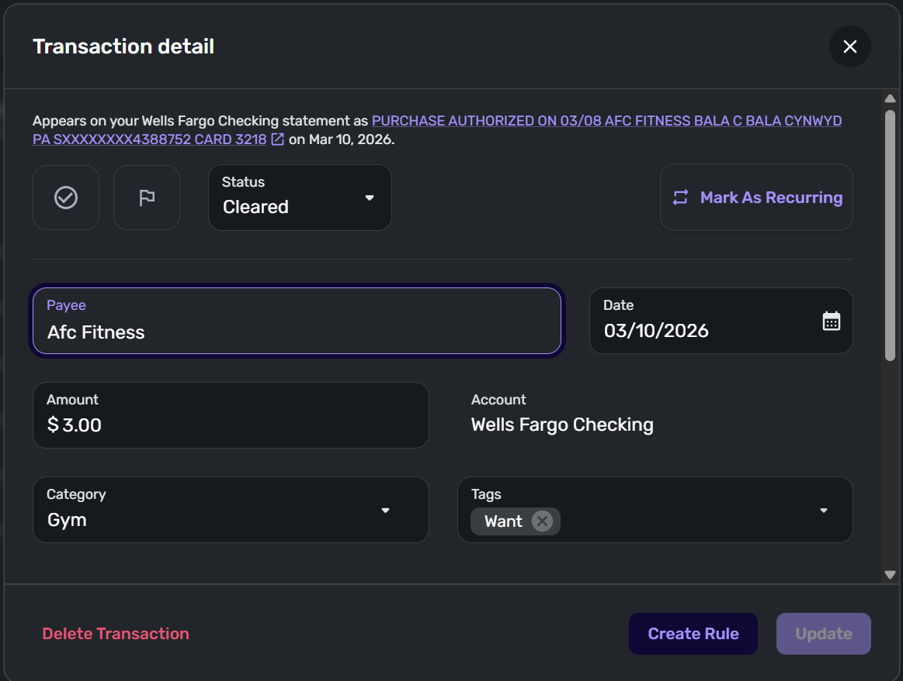
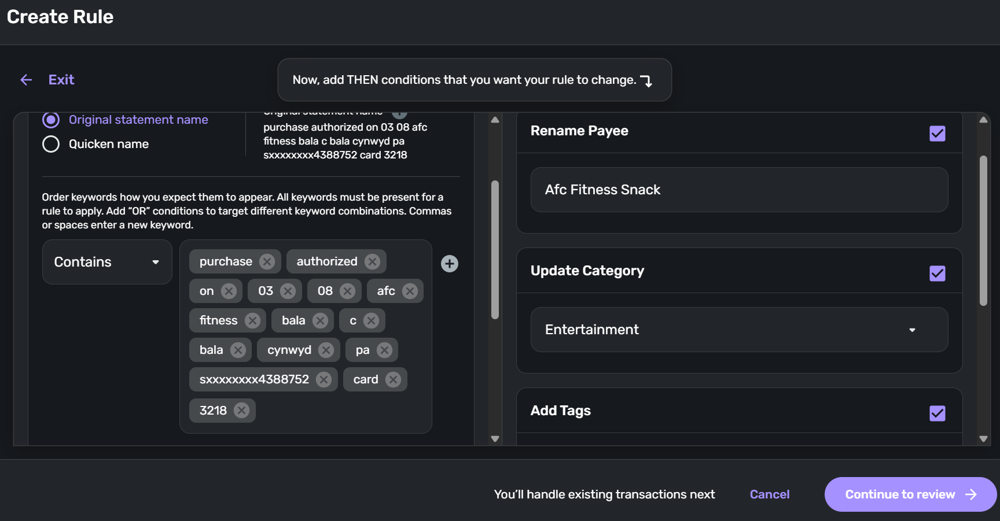
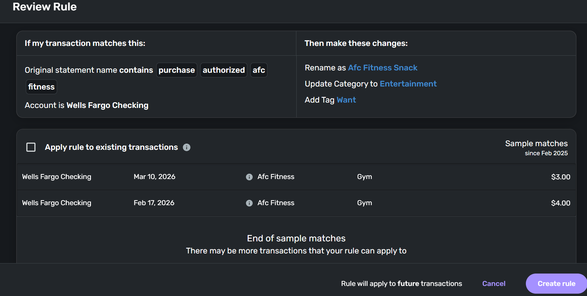
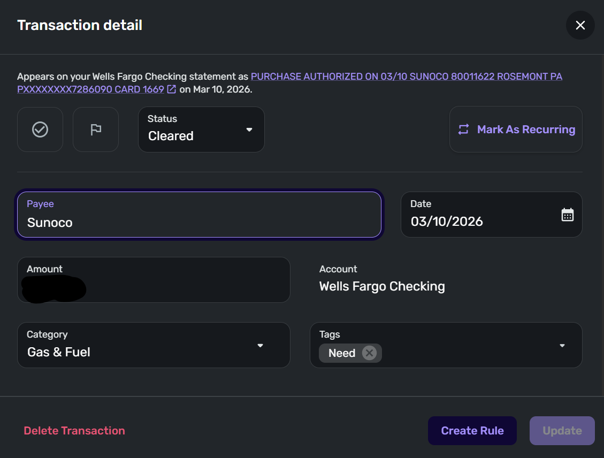
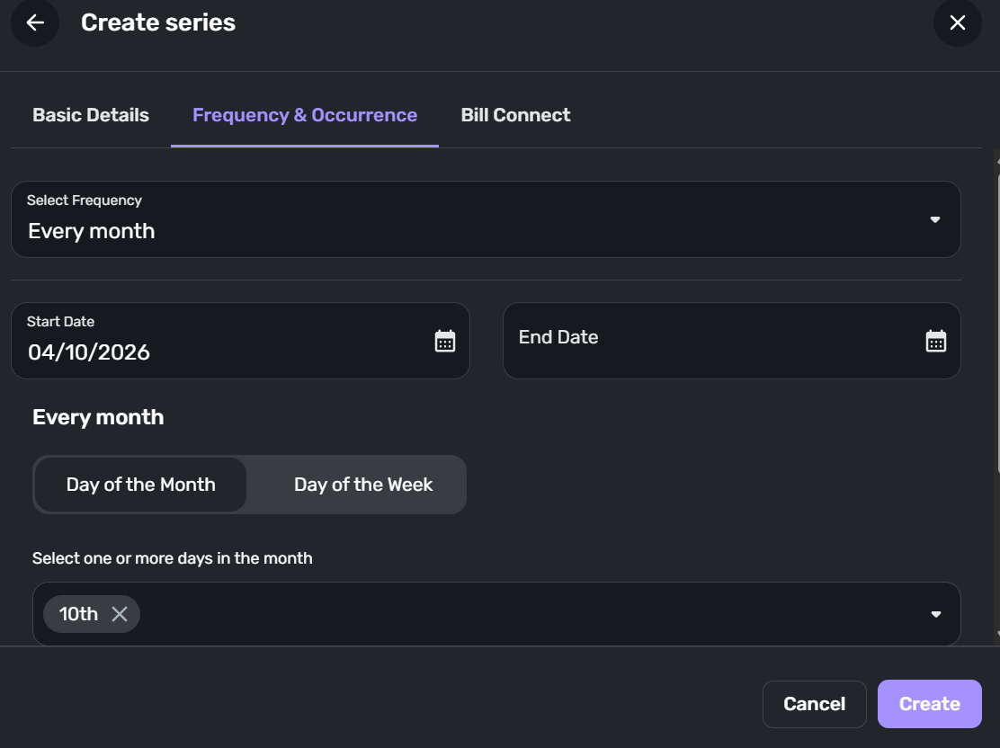
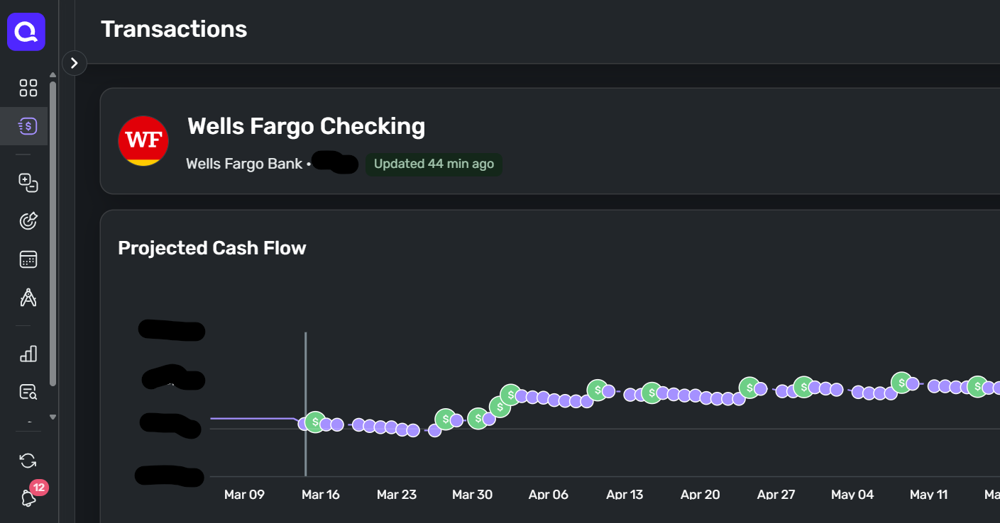
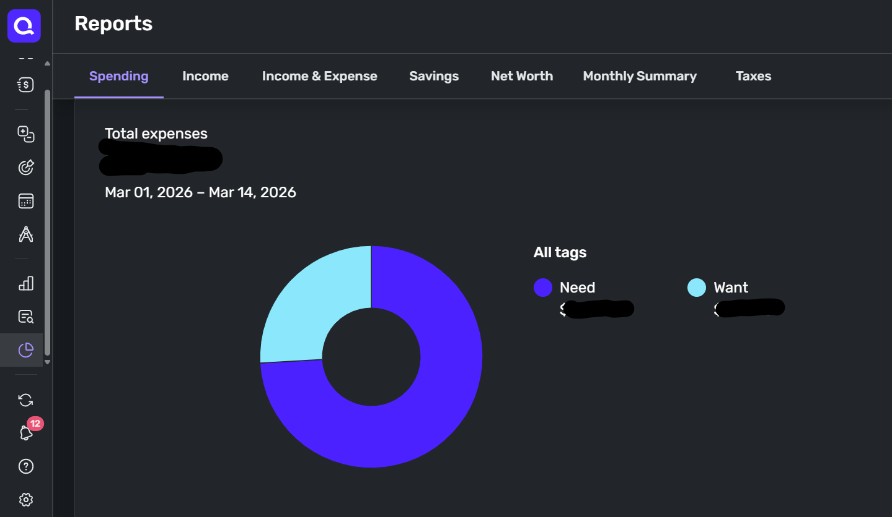

All electronic systems of accounting suck, unless you make more than enough money to cover the bills.

My first major attempt at keeping the books was with a vast spreadsheet system.  You know, like [Mister Money Mustache](LINK).

I broke a wide sheet into 52 chunks to represent fiscal weeks - they start when I get paid.  Each chunk had a balance rolled over from the previous week, and sections for upcoming income, regular bills, expected costs (like upcoming car repairs), and some other categories.

Each week, I would download all the line items from my bank website, and distribute them among all these categories.  Then, I'd work it until the balance on my spreadsheet was equal to the actual bank balance.

Rarely did it add up.  And rarely did the process take less than 2 hours.  And rarely did the result line up with my predictions.

I tried to speed the process up a few times with functions to automatically categorize things, but still, it was a tedious mess that only kind of worked, and absolutely stressed me out.

Wishing there were an easier system, I remembered an earlier experiment with [Mint](LINK) back in the day, which did everything I wished for.  Mint went bust, so I found the next best thing - [Simplifi](LINK).

## The Gap

Back when I was an elite member of the prestigious Lyndon LaRouche gang, I studied a lot of math.  We all did.  Half of every paper LaRouche wrote was about math.  Really, about how math is an inherently flawed model of the world, and dependence on (or "worship of") math had led to major economic problems. And war.  And sexual impotence.  And a bunch of other bad stuff.

I think, in essence, he's not wrong.

Here's how it works.  In math, you have a bunch of statements of bulletproof truths.  Those truths are derived logically according to the Rules of Math, from other more fundamental truths.  Those more fundamental truths are likewise derived from yet more fundamental truths, and so on, all the way down to a set of truths that can't be derived from anything else - the axioms, postulates, and definitions.

But whence this triumvirate of truth?

Well, that's debatable.  We hope the come straight from [*The Book*](LINK).  That they're the rules God used when He separated the Light from the Darkness.  That they're the true building blocks of nature.

However, they are NOT handed down from the Creator.  They're invented by people, usually in order to make the later derived proofs work out.  And, in the history of math, we've identified a few that are just wrong.  For example, Euclid's [parallel postulate](LINK).

So what do you get with a set of theorems proved true, according to an invented set of axioms, postulates, and definitions?  You get Star Wars.  Or Star Trek.

You get an approximation to a real world, but not the real world itself.

There's a *gap*.  It's our job not to keep doing proofs on a system that's inherently an approximation, but rather to find the places where the Real World gives a result that contradicts one of those proved "truths".

It's at that spot, where a new discovery lies in wait.  Like Einstein's theories of Relativity, which incidentally came directly out of the recognition that Euclid was wrong on parallel lines.

So this brings us back to Simplifi.

## Simplifi, or whatever, is the least worst

None of these big accounting apps can map the real world exactly.  They MUST go off the rails at some point, and require human intervention.

The least worst accounting software is whatever sounds good to you in about 15 minutes of searching on the web.  I like Simplifi, so you can start there if you want.

You have to be ready to think it sucks after a few weeks of using it, learn how to spot what's not working, and then figure out how to hack it into something that works better for you.  In the end, it's going to be something of a kludge built off of whatever you first downloaded and installed.  But, it will be *your* kludge.

The software will not bridge the *Gap* for you - you will have to build that bridge yourself.

Here are some hacks I've learned with Simplifi, to make it more my own:

1. Rules, Rules, Rules

In order for the Reports to work the way you need, you need to set up rules.  In the beginning, for every transaction that isn't some one-off ATM stop, create a rule.  

To do so, click on a transaction, then click on "Create Rule".

Here, you generalize the keywords Simplifi uses to identify the transaction in the future, give it a nice name you like, and configure all the things you want Simplifi to do when it sees one.  For example, maybe you guys get pizza every Friday, and you want that categorized as "Entertainment".

After you hit "Continue to Review", you have the option of running the rule on all past transactions that fit the pattern.  Do it!

In this way, you are training Simplifi how to read your transactions properly.

2. Set Recurring Bills and Income

If a transaction happens more than once, consider it a bill.  Click on the transaction (see the pattern?), and hit "Mark as Recurring".

Tell Simplifi how often this one happens, and when it usually happens, and how much it usually is.

When you mark regular bills (like your weekly pizza night), you can see how these hit your future cash flow.  To see your projected cash flow, either click on one of your accounts in the Dashboard, or click on Bills & Income, and then Cash Flow.  Pretty neat huh?

Oh, make sure to also mark any paychecks as Recurring.

3. Use Categories and Tags for Reporting

Each transaction can have one Category, but multiple Tags.  For the past couple weeks, I've been going in and manually marking each transaction with one of two tags:  Want and Need.

When you go to Reports, now you can see the breakdown of what you spent last month based on category, or tags.  For example, last month, I found out we spend a quarter of our income on Wants!

The point is, you need to think about these apps like they are pets.  Computer programs are inherently not models of the real world.  But, by training them, you can make them a little more useful for you.

_If you liked this article, please leave a comment below, share it with someone you know, and get on my email list!_ 

